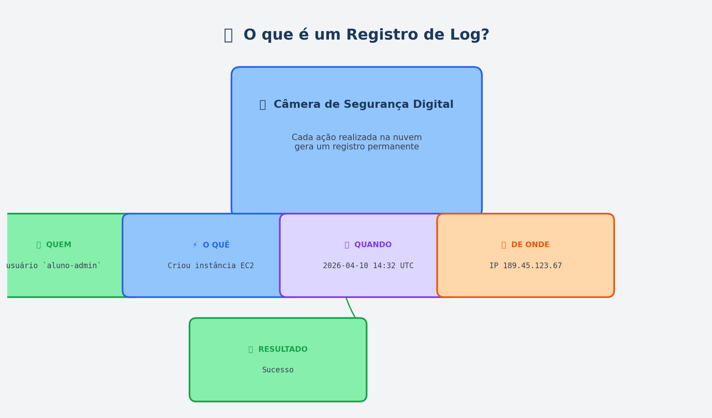
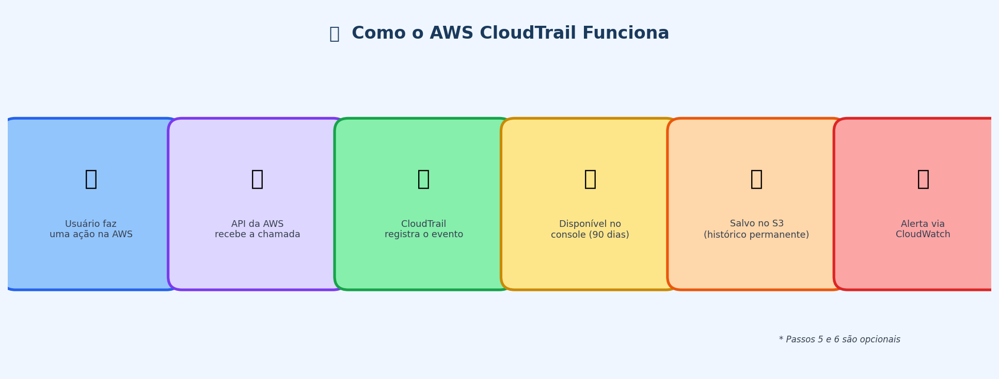
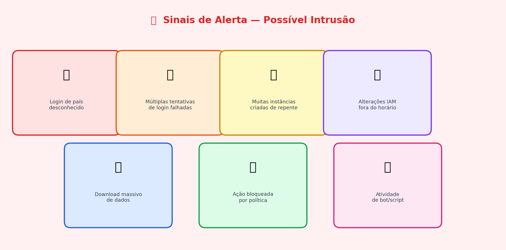
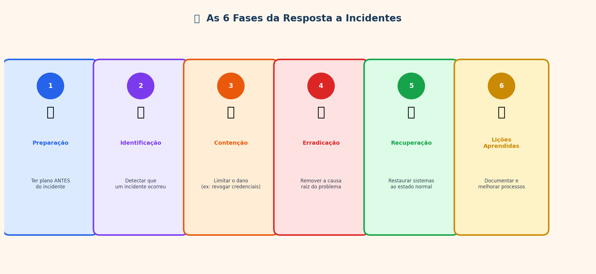
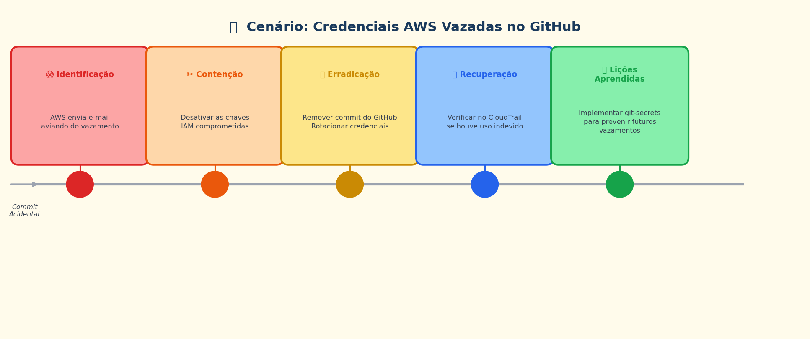
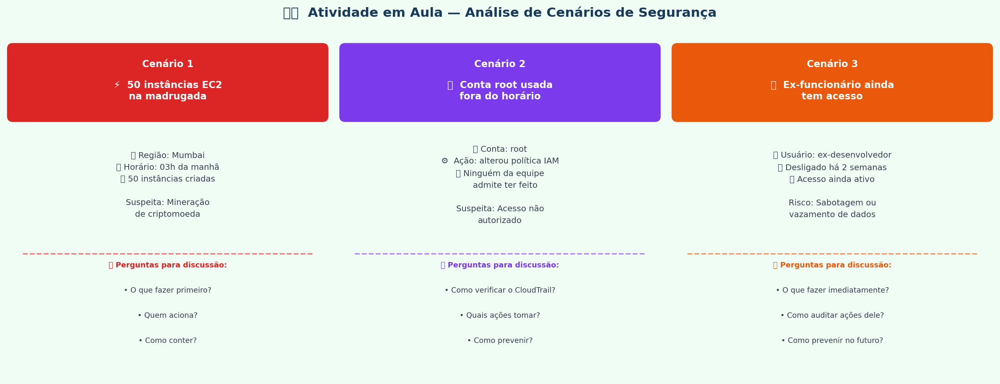

# Aula 02 - Segurança em Nuvem: Monitoramento e Resposta a Incidentes

**Computação em Nuvem**

---

## Agenda

1. O que é o Amazon S3?
2. Por que monitorar?
3. Ferramentas de log em nuvem
4. AWS CloudTrail na prática
5. Detecção de intrusão
6. Resposta a incidentes
7. Plano de resposta a incidentes
8. Demonstração: CloudTrail

---

## Recapitulando a Aula 01

- Aprendemos sobre o **modelo de responsabilidade compartilhada**
- Vimos como o **IAM** controla acesso aos recursos
- Criamos **usuários, grupos e políticas**
- Hoje vamos ver: **como saber o que está acontecendo na sua conta cloud?**

> **Pergunta:** Se alguém acessar sua conta AWS às 3h da manhã e deletar tudo, como você saberia?

---

## O que é o Amazon S3?

**S3 = Simple Storage Service** — o serviço de armazenamento de arquivos da AWS.

Pense nele como um **HD externo na nuvem**, mas com capacidade praticamente ilimitada, acessível de qualquer lugar do mundo e com alta durabilidade.

### Conceitos fundamentais:

| Conceito | O que é | Analogia |  
|---|---|---|
| **Bucket** | Contêiner que agrupa arquivos | Pasta raiz / drive (ex: `C:\`) |
| **Object** | Qualquer arquivo armazenado | Arquivo dentro da pasta |
| **Key** | Nome/caminho do arquivo dentro do bucket | Caminho completo do arquivo |
| **Region** | Localização física onde os dados ficam | Datacenter em SP, EUA, etc. |

### Como funciona na prática:

```
Você tem um bucket chamado:  faculdade-multiversa-logs

Dentro dele, os arquivos são organizados por caminho (key):

  faculdade-multiversa-logs/
  ├── cloudtrail/2026/04/10/evento_login.json
  ├── cloudtrail/2026/04/10/evento_deleteS3.json
  └── backups/2026/04/10/banco_producao.sql
```

### Por que o S3 aparece tanto em segurança?

- O **CloudTrail** pode exportar todos os logs para um bucket S3 (histórico permanente)
- Logs no S3 podem ser analisados por ferramentas como **Amazon Athena** com consultas SQL
- O S3 suporta **bloqueio de exclusão** (Object Lock) — ninguém apaga evidências de um incidente
- Permissões mal configuradas no S3 são uma das causas mais comuns de **vazamento de dados na nuvem**

### Exemplo de URL de um objeto no S3:

```
https://faculdade-multiversa-logs.s3.amazonaws.com/cloudtrail/2026/04/10/evento_login.json
```

> **Atenção:** Um bucket S3 configurado como **público** fica acessível para qualquer pessoa na internet. Foi isso que gerou o vazamento de dados da Uber.

---

## Por que monitorar?

### Sem monitoramento, você está no escuro:

- Não sabe **quem** acessou o quê
- Não sabe **quando** algo foi alterado
- Não consegue **provar** conformidade com regulações (LGPD, GDPR)
- Não detecta **ataques** até ser tarde demais

### Com monitoramento:

- Cada ação é registrada com data, hora, IP e usuário
- Alertas automáticos em caso de atividade suspeita
- Histórico completo para auditoria

---

## O que são Logs?

**Log = um registro detalhado de tudo que aconteceu**

Pense como uma **câmera de segurança digital** que grava todas as ações. Ao contrário de uma câmera física, os logs na nuvem são armazenados digitalmente, pesquisáveis e podem ser analisados automaticamente por ferramentas de segurança.

### Um registro de log típico contém:

| Campo | Exemplo |
|---|---|
| **Quem** | usuário `aluno-admin` |
| **O quê** | Criou uma instância EC2 |
| **Quando** | 2026-04-10 14:32:05 UTC |
| **De onde** | IP 189.45.123.67 |
| **Resultado** | Sucesso |



---

## Ferramentas de Log por Provedor

| Provedor | Ferramenta de Log | O que registra | Custo |
|---|---|---|---|
| **AWS** | CloudTrail | Todas as chamadas de API | Gratuito (90 dias) |
| **AWS** | CloudWatch Logs | Logs de aplicações e métricas | Free Tier disponível |
| **Azure** | Activity Log | Operações em recursos Azure | Gratuito |
| **Azure** | Monitor | Métricas e alertas centralizados | Free Tier disponível |
| **Google Cloud** | Cloud Audit Logs | Atividades administrativas | Gratuito (Admin Activity) |
| **Google Cloud** | Cloud Logging | Logs de aplicações | Free Tier (50 GB/mês) |

---

## AWS CloudTrail - Visão Geral

O **CloudTrail** registra **toda chamada de API** feita na sua conta AWS.

### O que ele captura:
- Logins no console
- Criação/exclusão de recursos (EC2, S3, RDS, etc.)
- Alterações em políticas IAM
- Tentativas de acesso negadas

### Exemplo de evento no CloudTrail:

```json
{
  "eventName": "DeleteBucket",
  "eventTime": "2026-04-10T14:32:05Z",
  "userIdentity": {
    "userName": "aluno-admin"
  },
  "sourceIPAddress": "189.45.123.67",
  "errorCode": "AccessDenied"
}
```

> Alguém tentou deletar um bucket S3 mas não tinha permissão!

---

## CloudTrail - Fluxo de Funcionamento



```
Usuário faz uma ação na AWS
        ↓
    API da AWS recebe a chamada
        ↓
    CloudTrail registra o evento
        ↓
    Evento fica disponível no console (até 90 dias grátis)
        ↓
    (Opcional) Salvar logs no S3 para histórico permanente
        ↓
    (Opcional) CloudWatch Alarms dispara alertas
```

---

## Azure Activity Log

Equivalente ao CloudTrail na Azure.

### O que registra:
- Criação, atualização e exclusão de recursos
- Alterações de permissões
- Alertas de integridade do serviço

### Como acessar:
1. Portal Azure -> Monitor -> Activity Log
2. Filtrar por período, recurso, operação
3. Exportar para análise

---

## Google Cloud Audit Logs

### Tipos de logs:
- **Admin Activity:** Alterações em configurações (sempre ativo, gratuito)
- **Data Access:** Leituras e gravações de dados (precisa ativar)
- **System Event:** Ações automáticas do Google Cloud
- **Policy Denied:** Tentativas bloqueadas por políticas de segurança

### Como acessar:
- Console -> Logging -> Logs Explorer

---

## O que é Detecção de Intrusão?

**Intrusão = alguém acessando seus sistemas sem autorização**

### Sinais de que algo está errado:

- Login de um país onde ninguém da equipe mora
- Múltiplas tentativas de login falhadas em sequência
- Criação repentina de muitas instâncias EC2 (possível mineração de cripto)
- Alteração de políticas IAM fora do horário comercial
- Download massivo de dados de um banco de dados



---

## Ferramentas de Detecção

| Provedor | Ferramenta | Função |
|---|---|---|
| **AWS** | GuardDuty | Detecção inteligente de ameaças (Free Trial 30 dias) |
| **AWS** | Security Hub | Painel centralizado de segurança |
| **Azure** | Microsoft Defender for Cloud | Detecção de ameaças e recomendações |
| **Google Cloud** | Security Command Center | Visão geral de segurança |

### AWS GuardDuty - como funciona:
- Analisa logs do CloudTrail, VPC Flow Logs e DNS automaticamente
- Usa machine learning para detectar padrões anormais
- Gera alertas com nível de severidade (baixo, médio, alto)

---

## Resposta a Incidentes - O que é?

**Incidente de segurança = qualquer evento que comprometa a segurança dos seus sistemas**

### Exemplos:
- Credenciais vazadas no GitHub
- Acesso não autorizado à conta
- Dados expostos publicamente
- Ataque DDoS contra seus serviços

> **A pergunta não é SE vai acontecer, mas QUANDO.**

---

## Plano de Resposta a Incidentes

### As 6 fases:



```
1. Preparação
   └─ Ter um plano ANTES que algo aconteça

2. Identificação
   └─ Detectar que um incidente ocorreu

3. Contenção
   └─ Limitar o dano (ex: desativar credenciais comprometidas)

4. Erradicação
   └─ Remover a causa raiz do problema

5. Recuperação
   └─ Restaurar sistemas ao estado normal

6. Lições Aprendidas
   └─ Documentar e melhorar para o futuro
```

---

## Cenário Prático: Credenciais Vazadas

**Situação:** Um desenvolvedor acidentalmente commitou as chaves de acesso AWS no GitHub público.



### Resposta passo a passo:

| Fase | Ação |
|---|---|
| **Identificação** | AWS envia e-mail alertando sobre credenciais expostas |
| **Contenção** | Desativar imediatamente as chaves IAM comprometidas |
| **Erradicação** | Remover o commit do GitHub, rotacionar todas as credenciais |
| **Recuperação** | Verificar no CloudTrail se houve uso não autorizado das chaves |
| **Lições** | Implementar git-secrets para prevenir futuros vazamentos |

---

## Boas Práticas de Monitoramento

1. **Ative o CloudTrail** em todas as regiões (não apenas na principal)
2. **Configure alertas** para ações críticas (ex: login da conta root)
3. **Centralize logs** em um bucket S3 com proteção contra exclusão
4. **Revise logs regularmente** - não adianta coletar e nunca olhar
5. **Automatize respostas** para incidentes comuns
6. **Teste seu plano** de resposta a incidentes periodicamente

---

## Demonstração ao Vivo

### Visualizando logs de atividade no CloudTrail

1. Acessar o console AWS -> CloudTrail
2. Abrir o **Event History** (histórico de eventos)
3. Filtrar por tipo de evento (ex: `ConsoleLogin`)
4. Analisar detalhes de um evento: quem, quando, de onde
5. Identificar uma tentativa de acesso negado (`AccessDenied`)

---

## Atividade em Aula

### Análise de Cenários de Segurança em Nuvem



**Formato:** Duplas ou trios | **Tempo:** ~20 minutos (5 min por cenário + 5 min discussão coletiva)

**Objetivo:** Aplicar as fases de resposta a incidentes e as ferramentas vistas em aula a situações reais.

---

### Cenário 1 — Atividade Suspeita em Região Inesperada

> **Você percebe que 50 instâncias EC2 foram criadas na região de Mumbai às 3h da manhã. A equipe não tem projetos nessa região.**

**Contexto adicional:**
- O custo estimado dessas instâncias é R$ 8.000/hora
- Todas as instâncias têm altíssimo uso de CPU (típico de mineração)
- O usuário responsável pelo `access_key` está de férias

---

### Cenário 2 — Conta Root Usada de Forma Suspeita

> **O CloudTrail mostra que a conta root foi usada para alterar uma política IAM às 23h. Nenhum membro da equipe admite ter feito isso.**

**Contexto adicional:**
- A política alterada agora permite que um novo usuário `backup-service` tenha acesso administrativo total
- A empresa tem 5 desenvolvedores com acesso ao console AWS
- Nenhum tem MFA (Autenticação Multifator) habilitado na conta root

---

### Cenário 3 — Ex-Funcionário com Acesso Ativo

> **Vocês descobrem que um ex-desenvolvedor, demitido há 2 semanas, ainda tem usuário IAM ativo e chaves de acesso funcionando.**

**Contexto adicional:**
- Ele tinha acesso ao ambiente de produção e ao banco de dados RDS
- O processo de offboarding da empresa não inclui revisão de acessos na nuvem
- Não há histórico de uso suspeito, mas não há como ter certeza

---

### Discussão Coletiva (5 minutos)

Após resolver os cenários, compartilhe com a turma:

- **Qual cenário foi mais difícil?** Por quê?
- **O que todos os cenários têm em comum?**
- **Se você fosse o responsável de segurança de uma empresa, qual seria a primeira política que implementaria?**

---

## Resumo da Aula

| Conceito | O que aprendemos |
|---|---|
| Logs | Registros de tudo que acontece na conta cloud |
| CloudTrail | Ferramenta AWS que registra todas as chamadas de API |
| Detecção de intrusão | Identificar acessos não autorizados |
| Resposta a incidentes | Plano de 6 fases para lidar com problemas de segurança |
| Boas práticas | Monitorar, alertar, automatizar e testar |

---

## Próxima Aula

**Aula 03 - Escalabilidade e Alta Disponibilidade em Nuvem**

- Como fazer seu sistema aguentar mais usuários
- Escalabilidade vertical vs horizontal
- Balanceamento de carga
- **Entrega do Exercício 1!**
- **Exercício 2 será atribuído**

> **Lembrete:** Exercício 1 - entrega na próxima aula!
