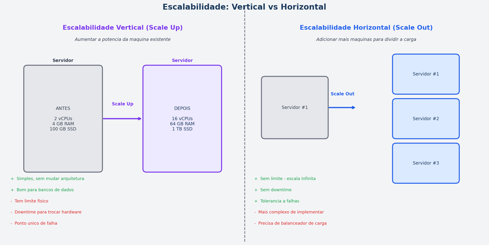
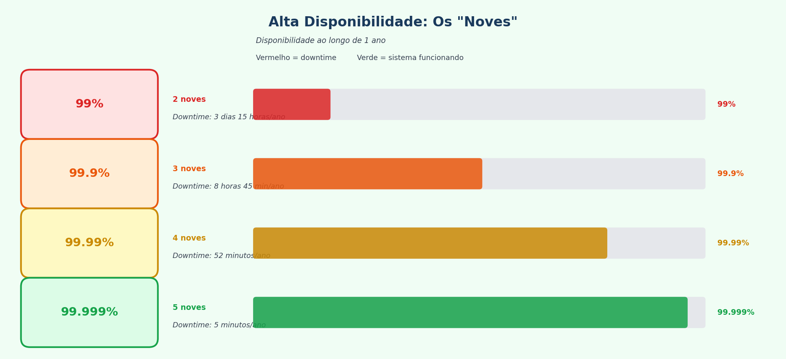
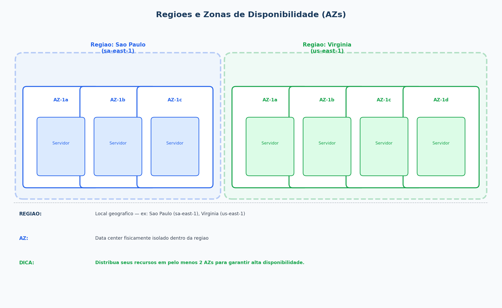
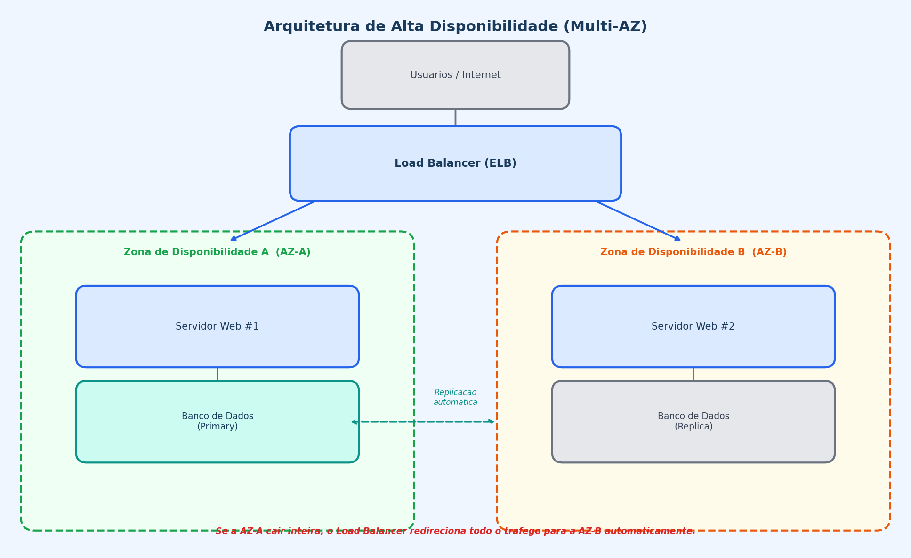
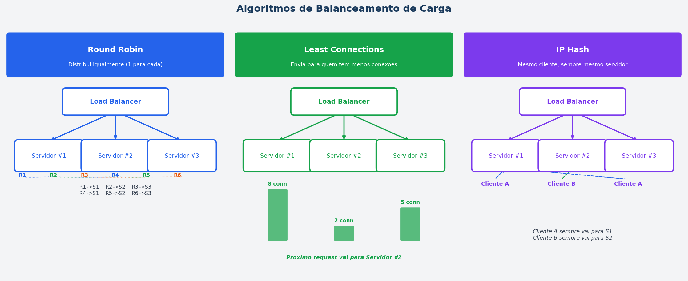
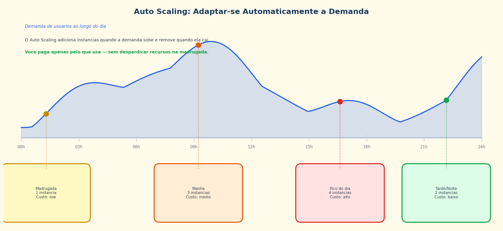

# Aula 03 - Escalabilidade e Alta Disponibilidade em Nuvem

**Computação em Nuvem**
---

## Agenda

1. Entrega do Exercício 1
2. O que é escalabilidade?
3. Escalabilidade vertical vs horizontal
4. Alta disponibilidade e tolerância a falhas
5. Balanceamento de carga
6. Autoescalonamento
7. Exercício 2

---

## Entrega do Exercício 1

- Dúvidas ou dificuldades encontradas?
- Breve revisão: o que aprendemos sobre IAM e políticas de segurança?

---

## O que é Escalabilidade?

**Escalabilidade = a capacidade do sistema de crescer (ou diminuir) conforme a demanda**

### Exemplo do dia a dia:

Imagine uma **lanchonete:**
- Dia normal: 10 clientes/hora -> 1 atendente dá conta
- Black Friday: 500 clientes/hora -> 1 atendente não dá conta!

### O que fazer?
- **Opção A:** Trocar o atendente por um super-robô ultra-rápido -> **Escalar verticalmente**
- **Opção B:** Contratar mais 10 atendentes -> **Escalar horizontalmente**

---

## Escalabilidade Vertical (Scale Up)

**Aumentar a potência de uma máquina existente**

### Vantagens:
- Simples - não muda a arquitetura
- Bom para bancos de dados tradicionais

### Desvantagens:
- Tem um **limite físico** (não existe máquina infinita)
- Requer **downtime** para trocar o hardware (em geral)
- Ponto único de falha - se cair, tudo cai

---

## Escalabilidade Horizontal (Scale Out)

**Adicionar mais máquinas para dividir a carga**

### Vantagens:
- **Sem limite** - adicione quantas máquinas precisar
- **Sem downtime** - adiciona sem parar o sistema
- **Tolerância a falhas** - se uma cair, as outras continuam

### Desvantagens:
- Mais complexo de implementar
- Precisa de um **balanceador de carga**

---

## Comparativo: Vertical vs Horizontal



| Aspecto | Vertical (Scale Up) | Horizontal (Scale Out) |
|---|---|---|
| O que faz | Máquina mais potente | Mais máquinas |
| Limite | Sim (hardware) | Praticamente ilimitado |
| Downtime | Geralmente sim | Não |
| Complexidade | Baixa | Maior |
| Custo | Cresce exponencialmente | Cresce linearmente |
| Tolerância a falhas | Não | Sim |
| Exemplo AWS | Trocar t2.micro por r5.4xlarge | Adicionar mais instâncias EC2 |

### Por que custo exponencial vs linear importa?

**Progressão Linear** — escalar horizontalmente

Cada instância adicionada custa o mesmo valor fixo. Se uma instância custa $c$, então $n$ instâncias custam:

$$C_{\text{linear}}(n) = c \cdot n$$

| Instâncias | Custo (ex: t3.medium a R\$ 0,20/h) |
|---|---|
| 1 | R\$ 0,20/h |
| 2 | R\$ 0,40/h |
| 4 | R\$ 0,80/h |
| 8 | R\$ 1,60/h |

Dobrar a capacidade = dobrar o custo. Crescimento **previsível**.

---

**Progressão Exponencial** — escalar verticalmente

Cada salto de categoria de instância é proporcionalmente mais caro que o anterior. O custo cresce mais rápido que a capacidade:

$$C_{\text{exp}}(n) = c \cdot r^{n}$$

onde $r > 1$ é o fator de crescimento a cada nível.

| Instância AWS | RAM | Custo/h (aproximado) | Fator de aumento |
|---|---|---|---|
| t3.micro | 1 GB | R\$ 0,05 | — |
| t3.medium | 4 GB | R\$ 0,20 | 4× |
| t3.xlarge | 16 GB | R\$ 0,80 | 16× |
| r5.4xlarge | 128 GB | R\$ 5,00 | 100× |

A capacidade quadruplicou em cada linha, mas o custo total cresceu **100 vezes** da primeira para a última — crescimento muito acima do linear.

> **Conclusão:** Para workloads que precisam escalar com frequência, a progressão linear do escalonamento horizontal é muito mais econômica a longo prazo do que a progressão exponencial do escalonamento vertical.

---

## Alta Disponibilidade - O que é?

**Alta Disponibilidade (HA) = o sistema continua funcionando mesmo quando algo falha**

### Medimos disponibilidade em "noves":

| Disponibilidade | Downtime por ano | Nome |
|---|---|---|
| 99% | 3,65 dias | Dois noves |
| 99.9% | 8,76 horas | Três noves |
| 99.99% | 52,56 minutos | Quatro noves |
| 99.999% | 5,26 minutos | Cinco noves |



---

## Como garantir Alta Disponibilidade?

### 3 estratégias principais:

### 1. Replicação
- Ter **cópias** do seu sistema em locais diferentes
- Se um falhar, o outro assume

### 2. Redundância
- Ter **componentes extras** prontos para uso
- Exemplo: dois servidores web em vez de um

### 3. Failover
- **Troca automática** para o sistema de backup quando o principal falha
- O usuário nem percebe a mudança

---

## Regiões e Zonas de Disponibilidade



### Conceitos:
- **Região:** Local geográfico (ex: São Paulo, Virgínia, Frankfurt)
- **Zona de Disponibilidade (AZ):** Data center isolado dentro de uma região

### Exemplo: Região São Paulo (sa-east-1)
- `sa-east-1a` -> Data center A
- `sa-east-1b` -> Data center B
- `sa-east-1c` -> Data center C

---

## Arquitetura de Alta Disponibilidade

Se a AZ-A cair inteira, a AZ-B continua atendendo!



---

## O que é Balanceamento de Carga?

**Load Balancer = distribui o tráfego entre vários servidores**

### Analogia:
Pense em um **recepcionista de hospital** que direciona pacientes para diferentes médicos conforme a disponibilidade.

### Benefícios:
- Nenhum servidor fica sobrecarregado
- Se um servidor cai, o tráfego vai para os outros
- O usuário nem percebe que existem múltiplos servidores

---

## Load Balancers na Nuvem

| Provedor | Serviço | Tipo |
|---|---|---|
| **AWS** | Elastic Load Balancer (ELB) | ALB, NLB, CLB |
| **Azure** | Azure Load Balancer | Layer 4 e 7 |
| **Google Cloud** | Cloud Load Balancing | Global e regional |

### Tipos de balanceamento:

- **Round Robin:** Distribui igualmente (1 para cada)
- **Least Connections:** Manda para quem tem menos conexões ativas
- **IP Hash:** Mesmo cliente sempre vai para o mesmo servidor



---

## O que é Autoescalonamento?

**Auto Scaling = ajustar automaticamente a quantidade de servidores conforme a demanda**



---

## Auto Scaling - Regras comuns

| Métrica | Regra de exemplo |
|---|---|
| **CPU** | Se CPU > 70% por 5 min -> adicionar 1 instância |
| **CPU** | Se CPU < 30% por 10 min -> remover 1 instância |
| **Requisições** | Se > 1000 req/seg -> adicionar 2 instâncias |
| **Memória** | Se RAM > 80% -> adicionar 1 instância |

### Configuração mínima:
- **Mínimo:** 1 instância (nunca ficar com zero)
- **Desejado:** 2 instâncias (para alta disponibilidade)
- **Máximo:** 10 instâncias (para controlar custos)

---

## Dimensionamento de Recursos

### Como escolher o tamanho certo?

| Pergunta | Impacta em |
|---|---|
| Quantos usuários simultâneos? | Número de instâncias |
| Tipo de processamento (CPU ou I/O)? | Tipo de instância |
| Quanto dado será armazenado? | Tipo e tamanho de storage |
| Qual a latência aceitável? | Região e tipo de rede |

### Dica: **Comece pequeno e escale conforme necessário**
- Monitore as métricas reais antes de provisionar mais recursos
- Use o CloudWatch para embasar decisões com dados

---

## Exercício 2 - Simulando Escalabilidade com Docker

**Prazo:** 2 semanas (entrega na Aula 05)

### Passo a passo:

**1. Instale o Docker Desktop**
Baixe em [docker.com/products/docker-desktop](https://www.docker.com/products/docker-desktop/) e certifique-se que está rodando antes de continuar.

**2. Crie o arquivo `docker-compose.yml`:**
```yaml
version: '3'
services:
  web:
    image: nginx:alpine
    ports:
      - "80"  # cada réplica recebe uma porta aleatória no host
```
> O campo `ports: - "80"` é essencial: sem ele os containers ficam isolados e não é possível enviar requisições para medir o desempenho.

**3. Suba 3 réplicas:**
```
docker compose up -d --scale web=3
```

**4. Confirme os containers e suas portas:**
```
docker compose ps
```
Você verá algo como:
```
NAME    STATUS    PORTS
web-1   Up        0.0.0.0:32768->80/tcp
web-2   Up        0.0.0.0:32769->80/tcp
web-3   Up        0.0.0.0:32770->80/tcp
```
Anote a porta do `web-1` (ex: `32768`) — você vai usar no próximo passo.

**5. Observe o uso de recursos em repouso**
Abra o **Docker Desktop**, clique em qualquer container e veja a aba **Stats**. Com 3 containers ociosos, o uso de CPU será próximo de 0%.

Ou no terminal:
```
docker stats
```

**6. Gere carga e observe a mudança**
Em outro terminal, envie 500 requisições para um dos containers (substitua `32768` pela porta anotada no passo 4):

```powershell
# PowerShell
for ($i = 1; $i -le 500; $i++) { Invoke-WebRequest -Uri http://localhost:32768 -UseBasicParsing | Out-Null }
```

Enquanto o loop roda, volte para o `docker stats` ou o Docker Desktop e observe o CPU% subindo no container que está recebendo as requisições.

**7. Aumente as réplicas para distribuir a carga:**
```
docker compose up -d --scale web=5
```
Agora repita o loop de carga, desta vez alternando entre as portas dos diferentes containers, e observe que a carga fica distribuída.

**8. Reduza para 1 réplica:**
```
docker compose up -d --scale web=1
```
Perceba que os outros containers são encerrados sem nenhuma interrupção no que continua rodando.

### Entrega:
Publique no **GitHub da equipe** um arquivo `.md` ou PDF contendo:
- O **nome completo de todos os integrantes da equipe** no início do documento
- Prints do `docker compose ps` com 3, 5 e 1 réplica
- Print do Docker Desktop (aba Stats) mostrando o CPU durante a geração de carga
- Respostas às perguntas:
  - Qual a diferença entre escalabilidade vertical e horizontal?
  - O que você acabou de fazer foi escalabilidade vertical ou horizontal? Por quê?
  - O que aconteceria se um dos containers falhasse com 3 réplicas? E com apenas 1?

---

## Resumo da Aula

| Conceito | O que aprendemos |
|---|---|
| Escalabilidade Vertical | Aumentar o poder de uma máquina |
| Escalabilidade Horizontal | Adicionar mais máquinas |
| Alta Disponibilidade | Sistema funciona mesmo com falhas |
| Balanceamento de Carga | Distribuir tráfego entre servidores |
| Autoescalonamento | Ajustar capacidade automaticamente |

---

## Próxima Aula

**Aula 04 - Recuperação de Desastres em Nuvem**

- O que fazer quando tudo dá errado?
- RPO e RTO
- Planos de contingência
- Estratégias de backup e failover
