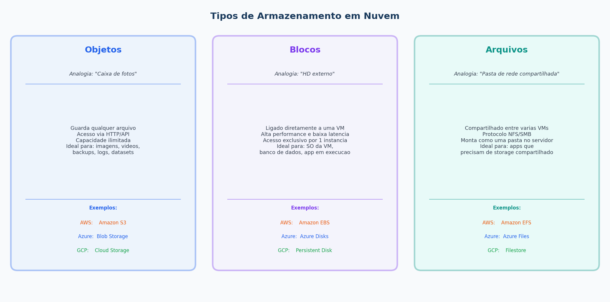
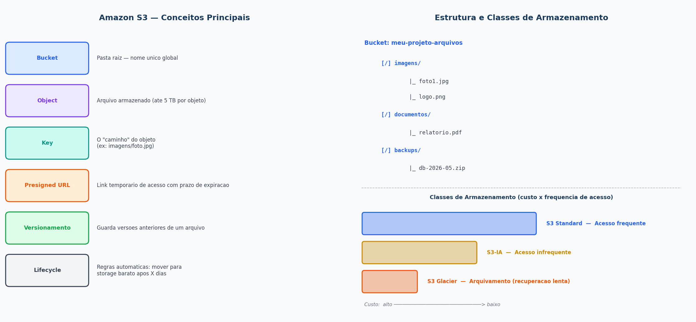
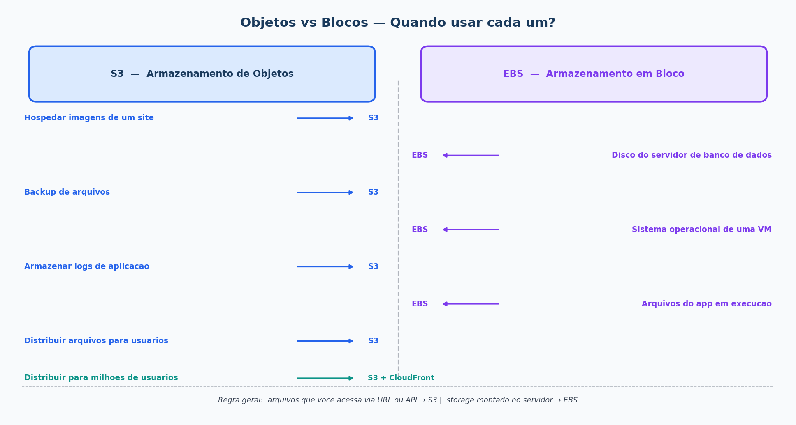
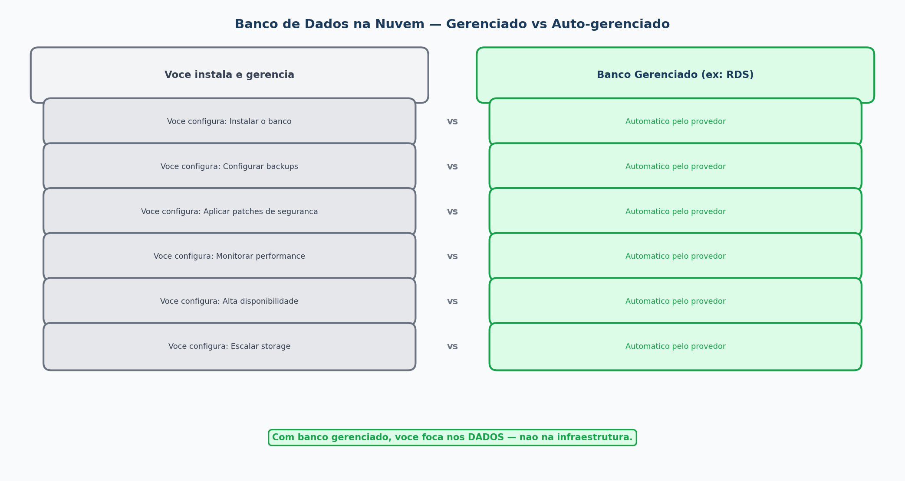
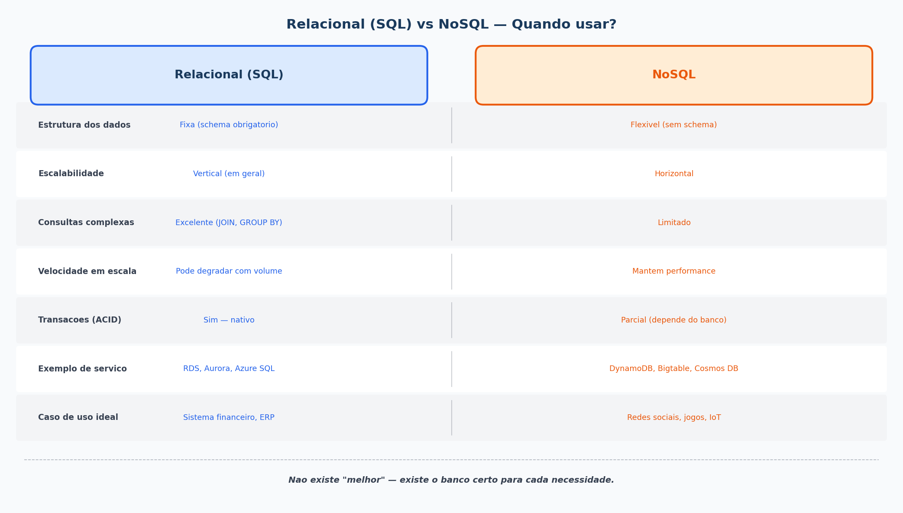
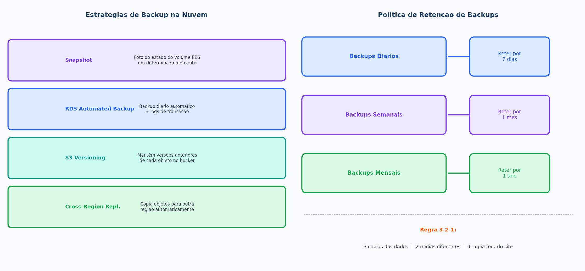

# Aula 04 - Armazenamento e Banco de Dados em Nuvem

**Computação em Nuvem**

---

## Agenda

1. Entrega do Exercício 2
2. Tipos de armazenamento em nuvem
3. Armazenamento de objetos - Amazon S3
4. Armazenamento em bloco - Amazon EBS
5. Bancos de dados na nuvem
6. Relacional vs NoSQL
7. Backup e recuperação de dados
8. Exercício 3

---

## Entrega do Exercício 2

- Quem ainda não entregou, entregue agora
- Dúvidas com o Docker Compose?
- Revisão rápida: o que é escalabilidade horizontal na prática?

---

## Tipos de Armazenamento em Nuvem

Existem **3 categorias principais** de armazenamento em nuvem:

---

## Armazenamento de Objetos

**O que é:** Armazena dados como "objetos" - cada um tem um ID único, os dados e metadados.

### Características:
- Acesso via HTTP/API (não é um sistema de arquivos)
- Praticamente **ilimitado** em capacidade
- Altamente **durável** (AWS S3: 99.999999999% - 11 noves)
- Ideal para: imagens, vídeos, backups, logs, datasets

---

## Armazenamento em Bloco

**O que é:** Armazenamento que funciona como um HD virtual - ligado diretamente a uma instância EC2.

### Características:
- Alta performance e baixa latência
- Acesso exclusivo por **uma instância por vez** (em geral)
- Ideal para: banco de dados, sistema operacional, arquivos de aplicação

### Amazon EBS (Elastic Block Store):
- Volume `/dev/xvda` → Sistema Operacional (ex: 20 GB)
- Volume `/dev/xvdb` → Banco de Dados (ex: 100 GB)
- Cada volume é independente e pode ser destacado/migrado

---

## Objetos vs Blocos - Quando usar cada um?

---

## Bancos de Dados na Nuvem

### Por que usar banco de dados gerenciado na nuvem?

---

## Bancos Relacionais na Nuvem

**Bancos relacionais** = dados organizados em tabelas com relações entre elas (SQL)

| Serviço | Provedor | Banco de dados suportado |
|---|---|---|
| **Amazon RDS** | AWS | MySQL, PostgreSQL, MariaDB, Oracle, SQL Server |
| **Amazon Aurora** | AWS | MySQL e PostgreSQL (performance até 5x maior) |
| **Azure SQL Database** | Azure | SQL Server |
| **Cloud SQL** | Google Cloud | MySQL, PostgreSQL, SQL Server |

### Quando usar banco relacional:
- Dados com estrutura bem definida e relações complexas
- Necessidade de transações (ACID)
- Relatórios e consultas complexas com JOIN

---

## Bancos NoSQL na Nuvem

**Bancos NoSQL** = não usam tabelas - armazenam dados de forma flexível (documentos, chave-valor, colunas, grafos)

| Serviço | Provedor | Tipo | Caso de uso |
|---|---|---|---|
| **DynamoDB** | AWS | Chave-valor / Documento | Sessões, carrinho de compras, IoT |
| **Amazon DocumentDB** | AWS | Documento (MongoDB) | Catálogos, perfis de usuário |
| **Google Bigtable** | GCP | Colunar | Big Data, séries temporais |
| **Azure Cosmos DB** | Azure | Multi-modelo | Apps globais com baixa latência |

---

## Relacional vs NoSQL - Quando usar?

---

## Integração: Nuvem + Banco Local (Híbrido)

Quando parte dos dados fica on-premises e parte na nuvem (conectados via **VPN** ou **Direct Connect**):

### Casos de uso comuns:
- Regulação exige dados sensíveis on-premises
- Migração gradual para a nuvem
- Sistemas legados que não podem ser movidos

---

## Backup e Recuperação de Dados na Nuvem

---

## Exercício 3 - Armazenamento de Arquivos no Amazon S3

**Prazo:** 2 semanas (entrega na Aula 05)

### Passo a passo:
1. Acesse o console AWS -> S3
2. Crie um bucket com nome único (ex: `(nome-do-github-do-grupo)-cloud-aula04`)
3. Faça upload de **3 arquivos** diferentes
4. Crie **2 pastas** e organize os arquivos
5. Gere um **Presigned URL** de um arquivo (link temporário)

### Entrega:
- Prints de cada etapa
- Responda: qual a diferença entre S3 e EBS? Por que o nome do bucket é único globalmente? O link temporário expira? Por quê?

> **Alternativa:** Use [LocalStack](https://localstack.cloud/) com `awslocal s3 mb s3://meu-bucket`

---

## Resumo da Aula

| Conceito | O que aprendemos |
|---|---|
| Armazenamento de objetos | S3 - arquivos via HTTP/API, escala ilimitada |
| Armazenamento em bloco | EBS - HD virtual ligado a instâncias EC2 |
| Banco relacional | RDS, Aurora, Azure SQL - SQL, transações, estrutura fixa |
| NoSQL | DynamoDB, Bigtable - flexível, escala horizontal |
| Banco gerenciado | Provedor cuida de backup, patches e HA |
| Backup | Snapshots, retenção por política, replicação entre regiões |

---

## Próxima Aula

**Aula 05 - Implementação de Aplicações em Nuvem**

- Monolito vs microserviços vs serverless
- Docker na prática
- AWS Lambda - funções sem servidor
