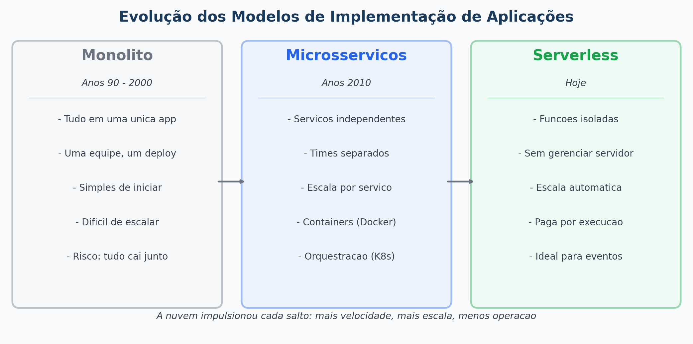
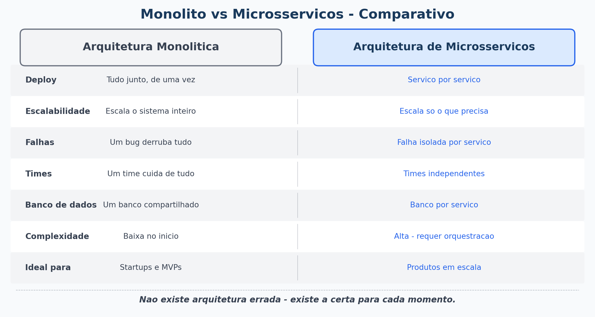
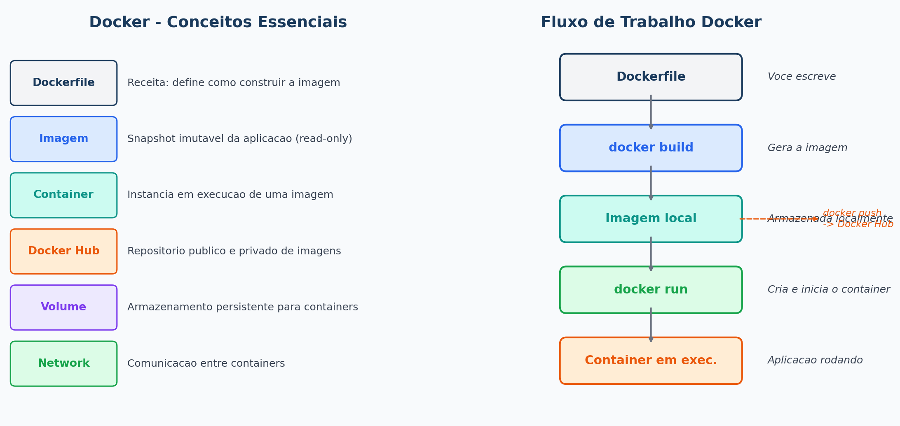
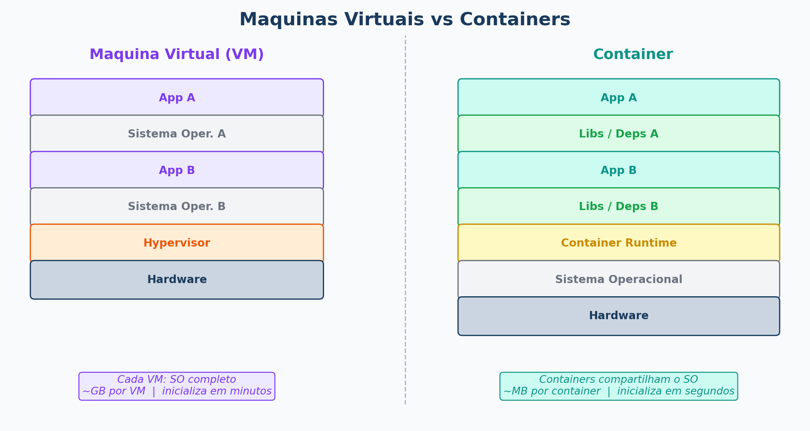
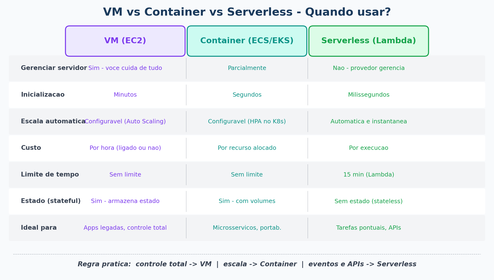

# Aula 05 - Implementação de Aplicações em Nuvem

**Computação em Nuvem**

---

## Agenda

1. Modelos de implementação de aplicações
2. Monolito vs Microserviços
3. Containers - Docker na prática
4. Kubernetes - orquestração de containers
5. Serverless - funções sem servidor
6. Demonstração: Docker
7. Exercício 4

---

## Recapitulando a Aula 04

- Armazenamento de **objetos** (S3) -> arquivos via HTTP
- Armazenamento de **blocos** (EBS) -> HD virtual para servidores
- Bancos **relacionais** (RDS) -> SQL, estrutura fixa
- Bancos **NoSQL** (DynamoDB) -> flexível, escala horizontal
- Hoje vamos ver: como as **aplicações** são implementadas na nuvem

---

## Evolução dos Modelos de Implementação



---

## Arquitetura Monolítica

**Tudo em uma única aplicação - interface, lógica de negócio e banco de dados juntos**

### Exemplo: E-commerce monolítico
```
┌────────────────────────────────────────┐
│           Aplicação Monolítica         │
│  ┌──────────┐  ┌──────────┐  ┌──────┐ │
│  │  Login   │  │ Produtos │  │Pedidos│ │
│  └──────────┘  └──────────┘  └──────┘ │
│  ┌──────────┐  ┌──────────┐           │
│  │Pagamentos│  │Relatórios│           │
│  └──────────┘  └──────────┘           │
└────────────────────────────────────────┘
              │
         Um único banco
```

### Vantagens: simples de desenvolver e testar inicialmente  
### Desvantagens: se uma parte falha, **tudo cai**; difícil de escalar partes específicas

---

## Arquitetura de Microserviços

**Cada funcionalidade é um serviço independente, com seu próprio banco de dados**

```
┌─────────┐    ┌─────────┐    ┌─────────┐    ┌─────────┐
│  Serviço│    │ Serviço │    │ Serviço │    │ Serviço │
│  Login  │    │Produtos │    │ Pedidos │    │Pagamento│
└────┬────┘    └────┬────┘    └────┬────┘    └────┬────┘
     │              │              │              │
   BD Auth        BD Catálogo    BD Pedidos    BD Finance
```

### Vantagens:
- Cada serviço escala **independentemente**
- Times diferentes trabalham em serviços diferentes
- Falha de um serviço não derruba os outros

### Desvantagens:
- Mais complexo de gerenciar e monitorar
- Comunicação entre serviços precisa ser bem planejada



---

## O que é um Container?

**Container = pacote que contém a aplicação + todas as suas dependências**

### Analogia:

```
Antes dos containers:         Com containers:
Cada produto precisava        Tudo no mesmo formato padrão
de embalagem especial         -> qualquer navio aceita
-> caótico e caro              -> padronizado e eficiente
```

### Por que containers são importantes?
- "Funciona na minha máquina" -> **funciona em qualquer lugar**
- Isolamento: cada container tem seu próprio ambiente
- Leve: compartilha o kernel do SO (diferente de VMs)

---

## Docker - O Padrão dos Containers

**Docker** é a plataforma mais usada para criar e executar containers.

### Conceitos essenciais:

| Conceito | O que é |
|---|---|
| **Imagem** | "Receita" do container - read-only |
| **Container** | Instância em execução de uma imagem |
| **Dockerfile** | Arquivo que define como criar a imagem |
| **Docker Hub** | Repositório público de imagens |

### Exemplo de Dockerfile:
```dockerfile
FROM python:3.11-slim
WORKDIR /app
COPY requirements.txt .
RUN pip install -r requirements.txt
COPY . .
CMD ["python", "app.py"]
```

---

## Docker - Comandos Básicos

```bash
# Baixar uma imagem
docker pull nginx

# Rodar um container
docker run -d -p 8080:80 nginx

# Ver containers rodando
docker ps

# Parar um container
docker stop <id>

# Construir uma imagem a partir do Dockerfile
docker build -t minha-app .

# Rodar com variáveis de ambiente
docker run -e DB_HOST=localhost minha-app
```



---

## Containers vs Máquinas Virtuais



---

## Kubernetes - Orquestração de Containers

**Kubernetes (K8s)** = sistema que gerencia múltiplos containers automaticamente

### O que o Kubernetes faz:
- **Deploy** de containers em múltiplos servidores
- **Reinicia** containers que falham automaticamente
- **Escala** horizontalmente baseado em CPU/memória
- **Distribui** carga entre containers saudáveis
- **Atualiza** containers sem downtime (rolling update)

### Kubernetes na nuvem (serviços gerenciados):

| Provedor | Serviço |
|---|---|
| AWS | EKS (Elastic Kubernetes Service) |
| Azure | AKS (Azure Kubernetes Service) |
| Google Cloud | GKE (Google Kubernetes Engine) |

> Para quem quiser aprender mais: Pesquisem sobre **Minikube**

---

## O que é Serverless?

**Serverless = executar código sem gerenciar servidores**

> Existe servidor? **Sim.** Mas você não vê, não configura, não paga quando não usa.

### Como funciona (AWS Lambda):
```
Evento ocorre                Sua função executa          Resultado retornado
(ex: upload no S3)    ->      (Python, Node, Java...)  ->   (processamento feito)
                             por milissegundos/segundos
                             Você paga apenas pelo tempo de execução
```

### Casos de uso ideais:
- Processar um arquivo após upload
- Responder a uma requisição de API
- Executar tarefas agendadas (cron)
- Processar mensagens de uma fila

---

## Serverless vs Container vs VM

| Aspecto | VM (EC2) | Container (ECS/EKS) | Serverless (Lambda) |
|---|---|---|---|
| Gerenciar servidor | Sim | Parcial | Não |
| Tempo de inicialização | Minutos | Segundos | Milissegundos |
| Escala automática | Configurável | Configurável | Automática |
| Custo | Por hora (ligado ou não) | Por recurso usado | Por execução |
| Limite de execução | Sem limite | Sem limite | 15 min (Lambda) |
| **Ideal para** | Apps complexas, legado | Microsserviços | Tarefas pontuais, APIs |



---

## Demonstração

### Deploy de um container simples com Docker

```bash
# 1. Baixar imagem do Nginx
docker pull nginx:alpine

# 2. Rodar o container expondo a porta 80
docker run -d -p 8080:80 --name meu-servidor nginx:alpine

# 3. Acessar no navegador: http://localhost:8080

# 4. Substituir o conteúdo padrão pelo nosso
echo "<h1>Minha primeira app em container!</h1>" > /usr/share/nginx/html/index.html

# 5. Atualizar o navegador e ver o resultado

# 6. Parar e remover o container
docker stop meu-servidor
docker rm meu-servidor
```

---

## Exercício 4 - Primeiro Container com Docker

**Prazo:** 2 semanas (entrega na Aula 07)

### Objetivo
Colocar uma aplicação simples no ar dentro de um container Docker, entendendo na prática os conceitos de imagem, container e Dockerfile.

### Passo a passo

**Parte 1 - Rodando seu primeiro container**
1. Instale o [Docker Desktop](https://www.docker.com/products/docker-desktop/) na sua máquina
2. Abra o terminal e execute:
   ```bash
   docker run hello-world
   ```
3. Tire um print mostrando a mensagem de sucesso

**Parte 2 - Criando sua própria imagem**
1. Crie uma pasta chamada `minha-app`
2. Dentro dela, crie um arquivo `app.py`:
   ```python
   # app.py
   print("Olá! Esta aplicação roda dentro de um container.")
   print("Meu nome: SeuNome")
   ```
3. Crie o `Dockerfile` na mesma pasta:
   ```dockerfile
   FROM python:3.11-slim
   WORKDIR /app
   COPY app.py .
   CMD ["python", "app.py"]
   ```
4. Construa e rode a imagem:
   ```bash
   docker build -t minha-primeira-app .
   docker run minha-primeira-app
   ```
5. Tire prints de cada etapa

**Parte 3 - Reflexão (responda no documento de entrega)**
- Qual a diferença entre uma **imagem** e um **container**?
- Por que o container é mais leve que uma VM?
- Em que situação você escolheria **Serverless (Lambda)** em vez de um container? E vice-versa?

### Entrega
- PDF ou documento com prints de cada etapa e as respostas das perguntas
- (Ponto extra) Publique a imagem no [Docker Hub](https://hub.docker.com/) e inclua o link (Ceis vão ter que pesquisar como faz)

> **Alternativa:** Se não conseguir instalar o Docker, usem o [Play with Docker](https://labs.play-with-docker.com/)

---

## Resumo da Aula

| Conceito | O que aprendemos |
|---|---|
| Monolito | Tudo junto - simples mas difícil de escalar |
| Microserviços | Serviços independentes - mais complexo, mais flexível |
| Container | Pacote portável com app + dependências |
| Docker | Plataforma padrão para containers |
| Kubernetes | Orquestrador de containers em escala |
| Serverless | Executa código sem gerenciar servidor - paga por execução |

---

## Próxima Aula

**Aula 06 - Performance e Gerenciamento de APIs em Nuvem**

- Caching e CDNs para acelerar aplicações
- API Gateway - gerenciar, proteger e versionar APIs
