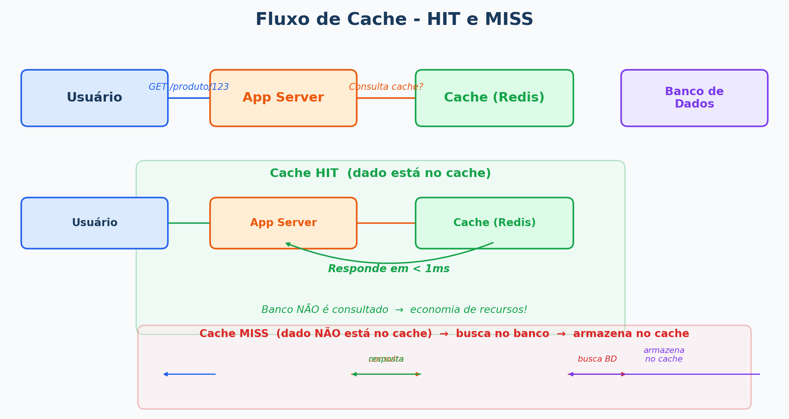
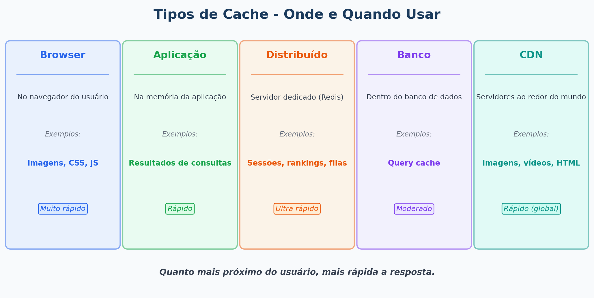
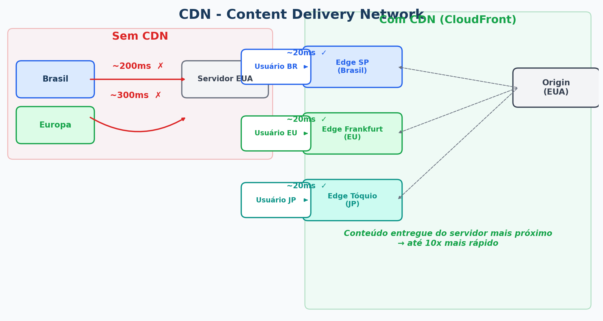
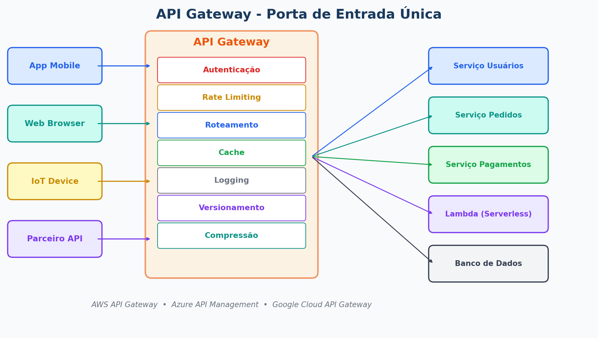
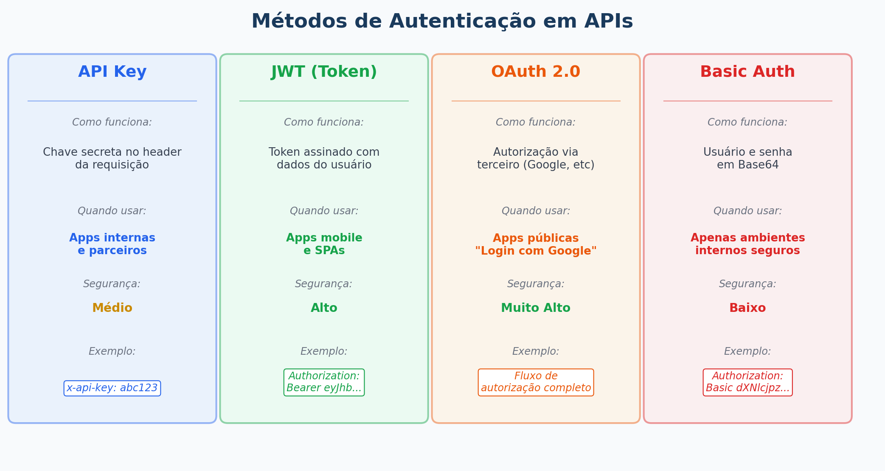

# Aula 06 - Performance e Gerenciamento de APIs em Nuvem

**Computação em Nuvem**

---

## Agenda

1. Por que performance importa?
2. Caching - acelerando aplicações
3. CDN - distribuindo conteúdo globalmente
4. Compressão de dados
5. API Gateway - gerenciando APIs na nuvem
6. Autenticação e versionamento de APIs

---

## Por que Performance Importa?

### Impacto direto no negócio:

| Lentidão | Impacto |
|---|---|
| +1 segundo de carregamento | -7% nas conversões (e-commerce) |
| +3 segundos | 53% dos usuários mobile abandonam a página |
| +100ms de latência | Amazon estimou -1% nas vendas |

> **Usuários não esperam.** Uma aplicação lenta é uma aplicação perdendo clientes.

### Os 3 principais gargalos de performance:
1. **Banco de dados** - consultas lentas, muitas requisições
2. **Rede** - distância entre servidor e usuário
3. **Processamento** - código ineficiente, sem paralelismo

---

### ✏️ Exercício 1 — Calculando o Impacto da Lentidão

Um e-commerce faz **R$ 100.000/mês** em vendas. O site está 2 segundos mais lento que o normal.

**Calcule:** usando a regra de -7% por segundo extra, qual é a perda mensal estimada?

<details>
<summary>Ver resposta</summary>

- 2 segundos extras → -14% nas conversões
- R$ 100.000 × 14% = **R$ 14.000/mês de perda estimada**

</details>

---

## O que é Caching?

**Cache = guardar temporariamente resultados de operações custosas para não repetir o trabalho**

### Analogia:
Imagine um garçom que anota os pedidos mais populares na memória — em vez de ir à cozinha toda vez, ele responde na hora.



### Benefícios:
- Reduz carga no banco de dados
- Resposta muito mais rápida (memória vs disco)
- Menor custo (menos consultas pagas)

---

## Tipos de Cache



| Tipo | Onde fica | Exemplo |
|---|---|---|
| **Cache de browser** | No navegador do usuário | Imagens, CSS, JS |
| **Cache de aplicação** | Na memória da aplicação | Resultados de consultas |
| **Cache distribuído** | Servidor dedicado | Redis, Memcached |
| **Cache de banco** | Dentro do banco | Query cache |
| **CDN** | Em servidores geograficamente distribuídos | Imagens, vídeos, HTML |

---

## Redis - Cache Distribuído na Nuvem

**Redis** = banco de dados em memória, ultra-rápido, usado como cache

### AWS ElastiCache (Redis gerenciado):

- **Cache HIT** → dado encontrado no Redis → resposta em < 1ms
- **Cache MISS** → dado não encontrado → busca no banco → armazena no Redis → responde

### Casos de uso do Redis:
- Cache de sessões de usuário
- Filas de tarefas (job queues)
- Rankings e contadores em tempo real
- Dados de configuração que mudam pouco

---

### ✏️ Exercício 2 — Cache HIT ou MISS?

Para cada situação abaixo, indique se seria um **Cache HIT** ou **Cache MISS**:

| Situação | Cache HIT ou MISS? |
|---|---|
| Usuário acessa a lista de produtos pela 1ª vez | |
| Usuário acessa a mesma lista 30 segundos depois | |
| Cache expira após 5 min; usuário acessa na hora 6 | |
| Produto novo é adicionado ao catálogo | |

<details>
<summary>Ver respostas</summary>

| Situação | Resposta |
|---|---|
| 1ª vez | **MISS** - dado ainda não está no cache |
| 30s depois | **HIT** - cache ainda válido |
| Após expirar | **MISS** - TTL expirou, busca no banco |
| Produto novo | **MISS** - novo dado, não está em cache |

</details>

---

## CDN - Content Delivery Network

**CDN = rede de servidores espalhados pelo mundo que entrega conteúdo do ponto mais próximo do usuário**



### O que uma CDN armazena:
- Imagens, vídeos, arquivos de áudio
- CSS, JavaScript, fontes
- Páginas HTML estáticas
- Arquivos para download

### CDNs disponíveis:
- **AWS CloudFront**
- **Azure CDN**
- **Google Cloud CDN**
- **Cloudflare** (gratuito para projetos pequenos!)

---

### ✏️ Exercício 3 — CDN na Prática

Acesse [www.cloudflare.com/speed/browser-insights](https://www.cloudflare.com/speed/browser-insights) ou o site do professor e, nas **DevTools do navegador** (F12 → aba Network):

1. Observe o campo **"Server"** ou **"x-cache"** nos headers de resposta
2. Se aparecer `HIT`, o conteúdo veio do CDN. Se `MISS`, veio do servidor de origem.
3. Atualize a página (F5) — o que mudou nos headers? Por quê?

> **Dica:** procure também pelo header `cf-cache-status` (Cloudflare) ou `X-Cache` (CloudFront).

---

## Compressão de Dados

**Comprimir dados antes de enviar pela rede = menos bytes = resposta mais rápida**

### Algoritmos comuns:
- **Gzip** - compressão de texto (HTML, JSON, CSS) - reduz até 70%
- **Brotli** - mais eficiente que Gzip - suportado por browsers modernos
- **Minificação** - remove espaços e comentários de JS/CSS

### Como habilitar no servidor (Nginx):
```nginx
gzip on;
gzip_types text/plain application/json application/javascript text/css;
gzip_min_length 1000;
```

> **CloudFront e outros CDNs comprimem automaticamente** — você não precisa configurar.

---

### ✏️ Exercício 4 — Calculando Ganho com Compressão

Um arquivo JSON de resposta de API tem **500 KB**. Com Gzip, ele é reduzido em 70%.

| Situação | Tamanho |
|---|---|
| Sem compressão | 500 KB |
| Com Gzip (-70%) | ? KB |
| 1.000 requisições/dia sem compressão | ? MB transferidos |
| 1.000 requisições/dia com Gzip | ? MB transferidos |

<details>
<summary>Ver respostas</summary>

| Situação | Tamanho |
|---|---|
| Com Gzip | **150 KB** |
| 1.000 req sem compressão | **500 MB/dia** |
| 1.000 req com Gzip | **150 MB/dia** → economia de 350 MB/dia |

</details>

---

## O que é uma API?

**API = Application Programming Interface = contrato de comunicação entre sistemas**

```
App Mobile                     Servidor
    │                              │
    │── GET /api/produtos ────────►│
    │                              │ Consulta o banco
    │◄── [{"id":1,"nome":"Camisa"}]│
    │                              │
```

### APIs REST — os verbos HTTP:

| Verbo | Ação | Exemplo |
|---|---|---|
| GET | Buscar dados | GET /usuarios/42 |
| POST | Criar recurso | POST /pedidos |
| PUT | Atualizar recurso | PUT /pedidos/99 |
| DELETE | Remover recurso | DELETE /produtos/5 |

---

### ✏️ Exercício 5 — Qual Verbo HTTP Usar?

Complete com o verbo correto (GET, POST, PUT ou DELETE):

| Ação | Verbo HTTP |
|---|---|
| Buscar o perfil do usuário de id 7 | |
| Cadastrar um novo cliente | |
| Alterar o endereço de entrega de um pedido | |
| Cancelar (remover) um pedido | |
| Listar todos os produtos disponíveis | |

<details>
<summary>Ver respostas</summary>

| Ação | Verbo HTTP |
|---|---|
| Buscar o perfil | **GET** /usuarios/7 |
| Cadastrar cliente | **POST** /clientes |
| Alterar endereço | **PUT** /pedidos/{id} |
| Cancelar pedido | **DELETE** /pedidos/{id} |
| Listar produtos | **GET** /produtos |

</details>

---

## API Gateway - O que é?

**API Gateway = porta de entrada única para todas as suas APIs**



### O que ele faz:

| Função | O que significa |
|---|---|
| **Autenticação** | Verifica se o cliente tem permissão |
| **Rate Limiting** | Limita requisições por cliente (ex.: 100/min) |
| **Roteamento** | Direciona para o serviço correto |
| **Logging** | Registra todas as requisições |
| **Versionamento** | Suporta múltiplas versões da API |
| **Cache** | Evita chamar o backend desnecessariamente |

### Serviços de API Gateway:
- **AWS API Gateway**
- **Azure API Management**
- **Google Cloud API Gateway**

---

### ✏️ Exercício 6 — Projetando um API Gateway

Você está construindo um app de delivery com 3 microsserviços:
- **Serviço de Cardápio** (lista pratos)
- **Serviço de Pedidos** (cria e acompanha pedidos)
- **Serviço de Pagamento** (processa cobranças)

**Desenhe (no papel ou em um diagrama)** o fluxo de uma requisição do app mobile até o serviço correto passando pelo API Gateway. Inclua pelo menos **2 funções** do gateway que fariam sentido aqui.

> **Dica:** pense em segurança (quem pode fazer pedidos?) e em limite de uso (evitar abusos no pagamento).

---

## Autenticação em APIs



### Métodos mais comuns:

| Método | Como funciona | Quando usar |
|---|---|---|
| **API Key** | Chave secreta no header da requisição | Apps internas, parceiros |
| **JWT (Token)** | Token assinado com informações do usuário | Apps mobile, SPAs |
| **OAuth 2.0** | Autorização via terceiro (ex: "Login com Google") | Apps públicas |
| **Basic Auth** | Usuário e senha em Base64 | Apenas em ambientes internos seguros |

### Exemplo de requisição com API Key:
```http
GET /api/produtos HTTP/1.1
Host: api.meusite.com
x-api-key: abc123secretkey456
```

---

### ✏️ Exercício 7 — Escolhendo o Método de Autenticação

Para cada cenário, escolha o método mais adequado:

| Cenário | Método Recomendado |
|---|---|
| App de banco com login e senha | |
| Integração B2B entre dois sistemas internos | |
| App que permite "Entrar com Google" | |
| API consultada por scripts internos da empresa | |

<details>
<summary>Ver respostas</summary>

| Cenário | Resposta |
|---|---|
| App de banco | **JWT** — token gerado após login, expira, seguro |
| Integração B2B interna | **API Key** — simples e controlado |
| "Entrar com Google" | **OAuth 2.0** — delegação de autorização |
| Scripts internos | **API Key** — fácil de rotacionar e auditar |

</details>

---

## Versionamento de APIs

**Versionar APIs = garantir que mudanças não quebrem clientes existentes**

### Estratégias:

```
# Por URL (mais comum)
GET /api/v1/usuarios
GET /api/v2/usuarios

# Por header
GET /api/usuarios
Accept: application/vnd.meuapp.v2+json

# Por query parameter
GET /api/usuarios?version=2
```

### Boas práticas:
- Nunca remova campos de uma API sem aviso
- Mantenha versões antigas por pelo menos 6 meses
- Comunique deprecações com antecedência

---

### ✏️ Exercício 8 — Versionamento na Prática

Você tem uma API `/api/v1/usuarios` que retorna:
```json
{ "id": 1, "nome": "Ana", "email": "ana@email.com" }
```

O time decidiu adicionar o campo `telefone` e **remover** o campo `email` na nova versão.

**Responda:**
1. Como você nomearia a nova rota?
2. Por quanto tempo manteria a v1 ativa?
3. O que você comunicaria aos clientes da v1?

<details>
<summary>Ver respostas</summary>

1. **`/api/v2/usuarios`** — nova versão por URL
2. **Pelo menos 6 meses** após o lançamento da v2
3. Avisar sobre a **deprecação da v1**, informar prazo de desativação e documentar a migração para v2

</details>

---

## Resumo da Aula

| Conceito | O que aprendemos |
|---|---|
| Caching | Guardar resultados temporariamente para respostas mais rápidas |
| Redis | Cache distribuído em memória — muito rápido |
| CDN | Servidores geograficamente distribuídos para entregar conteúdo próximo ao usuário |
| Compressão | Gzip/Brotli reduzem tamanho das respostas em até 70% |
| API Gateway | Porta de entrada única para gerenciar, proteger e rotear APIs |
| Autenticação | API Key, JWT, OAuth 2.0 |
| Versionamento | Garantir retrocompatibilidade ao evoluir APIs |

---

## Próxima Aula

**Aula 07 - Custos e Faturamento em Soluções de Nuvem**

- Como a cobrança em nuvem funciona
- Pay-per-use, instâncias reservadas e spot
- Ferramentas de monitoramento de custos
- Estratégias para gastar menos
