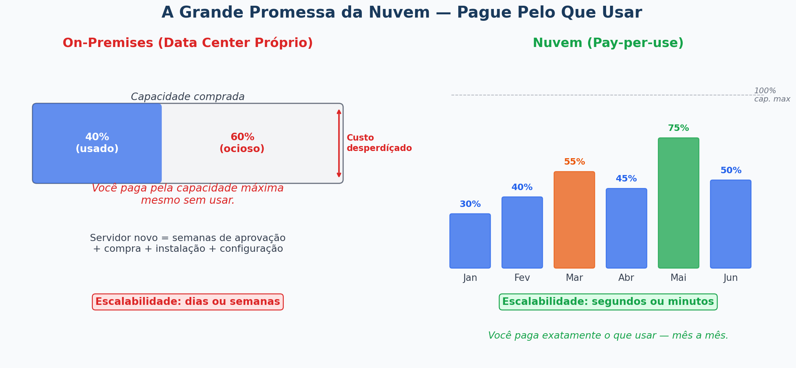
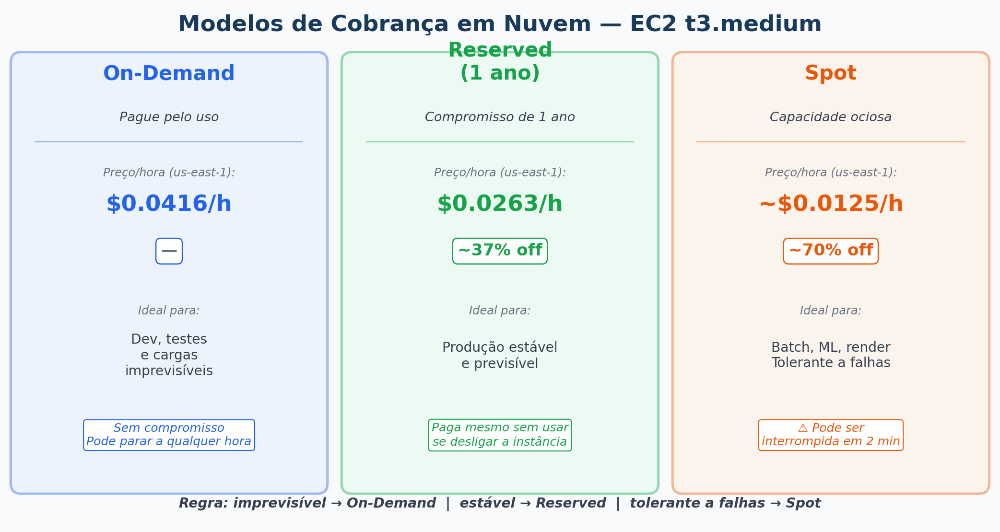
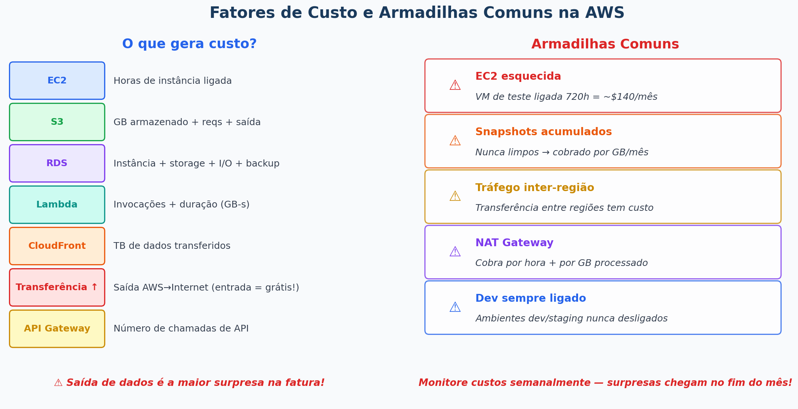
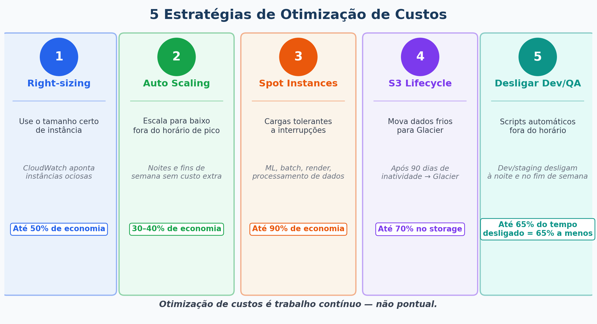

# Aula 07 - Custos e Faturamento em Soluções de Nuvem

**Computação em Nuvem**

---

## Agenda

1. Como a cobrança em nuvem funciona
2. Modelos de cobrança
3. Principais fatores de custo
4. Ferramentas de monitoramento de custos
5. Estratégias de otimização
6. Cases reais
7. Projeto Final (para casa)

---

## Recapitulando a Aula 06

- **Caching** (Redis, CDN) reduz latência e carga no banco
- **CDN** entrega conteúdo do ponto mais próximo ao usuário
- **API Gateway** gerencia, autentica e roteia chamadas de API
- Hoje vamos ver: **quanto tudo isso custa — e como gastar menos**

---

## A Grande Promessa da Nuvem

> **"Pare de pagar por capacidade ociosa — pague apenas pelo que usar."**



---

## Modelos de Cobrança



### 1. Pay-per-use (Pague pelo uso)
- Cobra por hora, minuto, segundo ou por requisição
- Ideal para: workloads imprevisíveis ou intermitentes
- Exemplo: EC2 On-Demand, Lambda (por invocação)

### 2. Instâncias Reservadas
- Compromisso de 1 ou 3 anos → **desconto de até 72%**
- Ideal para: workloads estáveis e previsíveis
- Exemplo: RDS Reserved, EC2 Reserved Instances

### 3. Instâncias Spot / Preemptível
- Usa capacidade ociosa do provedor → **desconto de até 90%**
- Pode ser interrompida com 2 minutos de aviso
- Ideal para: processamento em batch, renderização, treino de ML

---

### ✏️ Exercício 1 — Qual Modelo de Cobrança Usar?

Para cada cenário abaixo, escolha o modelo mais adequado (**On-Demand**, **Reserved** ou **Spot**) e justifique em uma frase:

| Cenário | Modelo |
|---|---|
| Servidor de produção de um banco, rodando 24/7 há 2 anos | |
| Pipeline de treino de modelo de ML que roda toda madrugada | |
| Ambiente de desenvolvimento de um desenvolvedor solo | |
| Processamento de imagens para um e-commerce na Black Friday | |

<details>
<summary>Ver respostas</summary>

| Cenário | Resposta |
|---|---|
| Servidor de banco 24/7 | **Reserved (3 anos)** — carga estável e previsível, máximo desconto |
| Treino de ML na madrugada | **Spot** — tolerante a falhas, enorme desconto, batch noturno |
| Dev solo | **On-Demand** — uso irregular, sem compromisso |
| Black Friday | **On-Demand** (ou Spot se tolerante) — pico imprevisível |

</details>

---

## Principais Fatores de Custo e Armadilhas



### Comparativo de Preços — EC2 t3.medium (us-east-1)

| Modelo | Preço/hora | Desconto | Ideal para |
|---|---|---|---|
| On-Demand | ~$0.0416 | — | Desenvolvimento, testes |
| Reserved (1 ano) | ~$0.0263 | ~37% | Produção estável |
| Reserved (3 anos) | ~$0.0180 | ~57% | Produção de longo prazo |
| Spot | ~$0.0125 | ~70% | Batch, tolerante a falhas |

> Valores aproximados para us-east-1 — consulte a [calculadora AWS](https://calculator.aws/) para valores atuais.

> ⚠️ **Atenção:** Transferência de dados de **saída** é uma das principais surpresas na fatura AWS. **Entrada é gratuita.**

---

## Ferramentas de Monitoramento de Custos

### AWS Cost Explorer
- Ver gastos por **serviço**, **conta**, **região** ou **tag**
- Analisar tendência dos últimos 12 meses
- **Prever gastos** dos próximos 12 meses com ML
- Recomendações de **Reserved Instances**

```
Console AWS → Cost Management → Cost Explorer
```

### Azure Cost Management
- **Budgets** (alertas quando custo ultrapassa limite)
- Recomendações de otimização com estimativa de economia
- Exportação para Excel ou CSV

```
Portal Azure → Cost Management + Billing
```

### Google Cloud Billing
- Exportação para **BigQuery** para análise avançada
- Budget Alerts por e-mail ou Pub/Sub

```
Exemplo de alerta:
50% do orçamento → e-mail
90% do orçamento → e-mail
100% do orçamento → desabilitar billing automaticamente
```

---

### ✏️ Exercício 2 — Calculadora AWS

Vamos simular o custo de uma aplicação web simples. Acesse [calculator.aws](https://calculator.aws/)

**Cenário:** Loja online com tráfego moderado. Adicione os seguintes serviços:

1. **EC2:** 2× t4g.nano, On-Demand, Linux, us-east-1
2. **RDS:** db.m1.xlarge, MySQL, 20 GB storage, Single-AZ
3. **S3:** 50 GB de storage + 100.000 requisições GET/mês
4. **CloudFront:** 100 GB de dados transferidos/mês
5. **Elastic Load Balancer:** 1 Application Load Balancer

**Responda:**
- Qual o custo total **On-Demand** estimado por mês?
- Qual seria com **Reserved Instances de 1 ano** nas instâncias EC2 e RDS?
- Quanto economizaria **por ano** com Reserved?

> Anote os valores e compare com a turma. Os resultados podem surpreender!

---

## Estratégias de Otimização de Custos



### Resumo das estratégias:

| Estratégia | Como funciona | Economia típica |
|---|---|---|
| **Right-sizing** | Usar instância do tamanho certo (CloudWatch ajuda) | Até 50% |
| **Auto Scaling** | Reduzir instâncias fora do horário de pico | 30–40% |
| **Spot Instances** | Workloads tolerantes a falhas | Até 90% |
| **S3 Lifecycle** | Mover dados para Glacier após 90 dias de inatividade | Até 70% no storage |
| **Desligar Dev/QA** | Scripts automáticos que desligam ambientes à noite | ~65% do tempo |

---

## Cases Reais de Otimização

### Netflix
- Usa Spot Instances massivamente para encoding de vídeo
- Economia de dezenas de milhões de dólares por ano

### Dropbox
- Migrou parte da infraestrutura de volta ao próprio data center
- Economia de ~$75 milhões em 2 anos (custo de storage em escala)

### Airbnb
- Implementou right-sizing automatizado
- Reduziu a fatura AWS em ~25% sem impacto na performance

> **Lição:** Na nuvem, otimização de custos é trabalho contínuo, não pontual.

---

### ✏️ Exercício 3 — Diagnóstico de Custos

A empresa abaixo tem uma fatura AWS de **$3.200/mês**. Analise o cenário e identifique as armadilhas:

**Situação:**
- 5 instâncias EC2 t3.large rodando 24/7 para produção, há 18 meses (On-Demand)
- 3 instâncias EC2 t3.medium para dev/QA, ligadas 24/7 inclusive fins de semana
- 200 snapshots EBS acumulados desde o início do projeto, nunca deletados
- Logs de produção sendo armazenados em S3 Standard (nunca acessados após 30 dias)

**Responda:**
1. Quais são as **3 principais armadilhas** de custo nesse cenário?
2. Que ação corretiva você tomaria para cada uma?
3. Qual modelo de cobrança você aplicaria nas instâncias de produção?

<details>
<summary>Ver respostas</summary>

1. **Armadilhas:**
   - Produção On-Demand há 18 meses (deveria ser Reserved)
   - Dev/QA ligado 24/7 — fins de semana são desperdício puro
   - Snapshots acumulados e logs em S3 Standard sem lifecycle

2. **Ações corretivas:**
   - Converter produção para Reserved (1 ano) → ~37% de desconto
   - Script que desliga dev/QA sexta às 20h e liga segunda às 8h → ~65% menos horas
   - Deletar snapshots antigos desnecessários; criar lifecycle no S3 para mover logs para Glacier após 30 dias

3. **Produção estável → Reserved (1 ano ou 3 anos)**

</details>

---

## Resumo da Aula

| Conceito | O que aprendemos |
|---|---|
| Pay-per-use | Paga pelo que usa — ideal para workloads variáveis |
| Reserved Instances | Compromisso de 1–3 anos — até 72% de desconto |
| Spot Instances | Capacidade ociosa — até 90% de desconto — pode ser interrompida |
| Cost Explorer | Ferramenta AWS para analisar e prever gastos |
| Right-sizing | Usar o tamanho certo de instância |
| Lifecycle policies | Mover dados frios para storage mais barato automaticamente |

---

## Projeto Final — Para Casa

**Prazo:** 2 semanas (entrega na Semana 9 - Prova)

### Escolha um cenário:
- **A:** Loja virtual com picos na Black Friday
- **B:** App de saúde com dados sensíveis de pacientes
- **C:** Startup com modelo de IA para recomendação de produtos

### Entregas:
1. **Diagrama** no [Draw.io](https://app.diagrams.net/): compute, storage, segurança, escalabilidade, DR
2. **Documento (1–2 páginas):** justificativa das escolhas, riscos, o que mudaria com mais orçamento
3. **Estimativa de custos** na [Calculadora AWS](https://calculator.aws/)

---

## Próxima Aula

**Aula 08 - Tendências Emergentes em Computação em Nuvem**

- Multicloud e nuvem híbrida
- Edge Computing
- IA e Machine Learning na nuvem
- Big Data na nuvem
